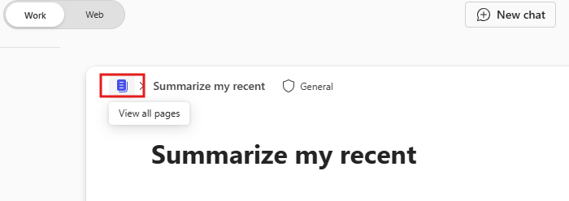

---
task:
  title: Immersionserfahrung - Geschäftsleitende Person
---

## Immersionserfahrung - Geschäftsleitende Person  

Optimieren Sie Ihre täglichen Aufgaben, indem Sie Mitteilungen überprüfen, eine E-Mail versenden und sich auf eine bevorstehende Besprechung vorbereiten.  

Sie werden drei Aufgaben erfüllen:  

- Überprüfen Sie die Kommunikation mit **Microsoft 365 Copilot Chat**.  
- Bereiten Sie Besprechungspunkte mit **Copilot in Pages** vor.
- Entwerfen sie eine Nachverfolgungs-E-Mail mit **Copilot in Outlook**.  

> **HINWEIS:** Beispiel-Eingabeaufforderungen werden bereitgestellt, um Ihnen bei den ersten Schritten zu helfen. Sie können sie Ihren Bedürfnissen entsprechend anpassen —seien Sie kreativ und erkunden Sie sie! Wenn Copilot nicht das gewünschte Ergebnis liefert, verfeinern Sie Ihre Eingabeaufforderung und versuchen Sie es erneut. Genießen Sie den Prozess und haben Sie Spaß beim Experimentieren!  

### Aufgabe 1: Überprüfung der Kommunikation  

Mit **Microsoft 365 Copilot Chat** können Sie Erkenntnisse aus den letzten Interaktionen mit einer bestimmten Person zu einem bestimmten Thema oder Projekt sammeln. Konzentrieren Sie sich auf die Ermittlung der wichtigsten Punkte, Aktionen und offenen Fragen. So bleiben Sie immer auf dem neuesten Stand der Teamprojekte und können die Beteiligten über Fortschritte, Herausforderungen und Ergebnisse informieren.  

**Schritte**:

- Öffnen Sie eine neue Browser-Registerkarte und navigieren Sie zu [M365copilot.com](https://m365copilot.com/).
- Stellen Sie sicher, dass die Registerkarte "Arbeitsmodus" im Copilot-Chat ausgewählt ist:

    

**Beispiel-Eingabeaufforderung**:

```text
Summarize my recent interactions with [/Name of Person] regarding [specific topic or project]. Organize the summary by key points or actions discussed, and include any follow-up items or outstanding questions that may require attention.
```

> **Hinweis:** Ersetzen Sie [Name der Person] durch die Person, auf die Sie sich konzentrieren, und [bestimmtes Thema oder Projekt] durch das entsprechende Thema. Verwenden Sie das Zeichen **/** (Schrägstrich), um auf interne Kontakte zu verweisen und einen schnellen Zugriff auf die letzten Interaktionen zu ermöglichen.

### Aufgabe 2: Vorbereiten einer Besprechung  

Erstellen Sie mit **Copilot in Pages** Gesprächspunkte für eine bevorstehende Stakeholder-Besprechung auf der Grundlage der im Microsoft 365 Copilot Chat gesammelten Erkenntnisse. Konzentrieren Sie sich auf Status-Updates, wichtige Termine, Herausforderungen oder Risiken und handlungsrelevante nächste Schritte, um eine produktive Diskussion zu gewährleisten.

**Schritte**:

1. Wählen Sie unter **Antwort von Copilot Chat** aus der vorherigen Aufgabe **Bearbeiten in Pages**:  
   

2. Wählen Sie im neu geöffneten Bildschirm Pages die Option **Alle Seiten anzeigen**:  
   

3. Im neuen Seitenfenster können Sie mit Copilot interagieren, indem Sie das **Copilot-Symbol** auf der rechten Seite des Dokuments auswählen.

**Beispiel-Eingabeaufforderung**:

```text
Using these insights, draft talking points for an upcoming stakeholder meeting. Focus on progress updates, key dates, challenges and next steps. 
```

> **Tipp:**  
> - Pages kann als Kollaborationsaum genutzt werden, um mit Ihren Arbeitskontakten in Echtzeit zu arbeiten. Geben Sie die Seite frei, indem Sie das „@“-Symbol gefolgt von dem Namen einer Kollegin bzw. eines Kollegen eingeben.
> - Nachdem Sie Ihre Kollegin oder Ihren Kollegen hinzugefügt haben, klicken Sie auf den entsprechenden Namen, um ihr oder ihm Zugriff zu gewähren. Sie erhalten eine E-Mail-Benachrichtigung mit einem Link, über den sie an der Seite mitarbeiten können.  

### Aufgabe 3: Senden einer Nachverfolgungs-E-Mail  

Verfassen Sie mit **Copilot in Outlook** eine Nachverfolgungs-E-Mail auf der Grundlage der im Microsoft 365 Copilot-Chat gewonnenen Erkenntnisse. Geben Sie Details an, wie etwa Status-Updates, unerledigte Aktionen, nächste Schritte und die Anforderung eines Folgetreffens zur weiteren Diskussion.

**Schritte**:

- In **Outlook**, wählen Sie **Neue E-Mail** und dann im Menüband **Copilot** > **Entwurf mit Copilot**.

    

**Beispiel-Eingabeaufforderung**:

```text
Using the insights below, draft a follow-up email to [Name of Person] requesting an update on progress and next steps. Also, ask for a follow-up meeting to discuss further on the project deadline. 

[Paste insights from Copilot Chat here, or add your own insights]
```
