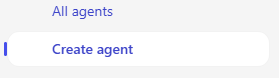

---
task:
  title: "Immersionserfahrung\_– Agents (Führungskräfte)"
---

## Immersionserfahrung – Agents (Führungskräfte)

Hier erfahren Sie, wie Microsoft 365 Copilot und Copilot Studio Ihnen helfen können, sich einer echten arbeitsbezogenen Herausforderung zu widmen, indem Sie einen einfachen **abrufbasierten Agent** entwerfen. In dieser Übung erfahren Sie, wie Sie ein Problem identifizieren, es aufschlüsseln, untersuchen, wo KI hilfreich sein könnte, und dann einen konzeptionellen Agent erstellen, um das Problem zu lösen.  

Sie führen vier Aufgaben aus:

- Identifizieren eines arbeitsbezogenen Problems  
- Aufschlüsseln des Problems und Untersuchen, wo KI hilfreich sein könnte  
- Verwenden von **Recherche-Agent**, um Erkenntnisse und Lösungsideen zu gewinnen  
- Konzipieren und Modellieren eines abrufbasierten Agents in **Copilot Studio**  

> **HINWEIS:** Es werden Beispielprompts bereitgestellt, die Sie bei den ersten Schritten unterstützen. Diese können Sie an Ihre Anforderungen anpassen. 
>
> Wenn Sie Unterstützung beim Generieren oder Optimieren von Prompts benötigen, probieren Sie den <a href="https://appsource.microsoft.com/en-us/product/office/WA200007578" target="_blank">Prompt Coach-Agent</a> aus.<br>Dieser kann Prompts vorschlagen, verbessern und auswerten, damit Sie mit Copilot bessere Ergebnisse erzielen.

### Aufgabe 1: Identifizieren einer arbeitsbezogenen Herausforderung  

Denken Sie zunächst an ein echtes Problem in Ihrer Rolle: Ein Problem, durch das Sie verlangsamt werden oder das Ihnen den Zugriff auf Informationen erschwert. Sie können allein darüber nachdenken oder **Copilot Chat** als Partner verwenden, um Ideen zu generieren und eine Herausforderung zu identifizieren, bei der das Abrufen und Organisieren von Wissen einen Unterschied machen würde.  

Berücksichtigen Sie zur Unterstützung Ihrer Überlegungen Folgendes:  

- **Was funktioniert heute gut**  
- **Was funktioniert nicht gut**  
- **Wo *könnte* KI helfen**  

**Schritte**:  

- Öffnen Sie eine neue Browserregisterkarte, und navigieren Sie zu [m365.cloud.microsoft/chat](https://m365.cloud.microsoft/chat).  
- Stellen Sie sicher, dass in **Copilot Chat** die Registerkarte **Arbeitsmodus** ausgewählt ist:  

     

    **Beispielprompt:**

   ```text
   I’m researching common day-to-day issues I face at work, such as processes, collaboration, or time management. Look at recent conversations from [Teams chats, Outlook emails, or other collaboration tools] related to [your role focus]. Summarize the key issues or pain points mentioned in the last 6 months. Show the results in a table with:  

    - Title: Short label for the issue  
    - Description: Brief summary of the challenge  
    - Frequency: How often it comes up (e.g., number of mentions)
   ```

### Aufgabe 2: Aufschlüsseln des Problems

Schlüsseln Sie die Herausforderung, die Sie in Aufgabe 1 identifiziert haben, mithilfe von **Copilot Chat** in kleinere Teile auf:

- Wodurch wird dieses Problem erschwert?  
- Wo werden Informationen aufgehalten oder gehen verloren?  
- Wer ist am meisten betroffen?  

    **Beispielprompt (Copilot Chat – Arbeitsmodus):**

    ```text
    Break down the problem of [insert challenge]. Identify root causes, pain points, and which areas of work are most affected.
    ```

    > **TIPP:** Denken Sie darüber nach, wo das Abrufen von Wissen Ihnen Zeit sparen oder Ihrem Team helfen würde, schnellere Entscheidungen zu treffen.

### Aufgabe 3: Erkunden von Ideen zu KI-Lösungen mit Recherche-Agent

Verwenden Sie **Recherche-Agent**, um zu erfahren, wie Copilot und Agents hilfreich sein könnten. Konzentrieren Sie sich auf Lösungen, die Wissen abrufen, organisieren oder zusammenfassen und nicht Aufgaben automatisieren. 

**Schritte**:

- Öffnen Sie eine neue Browserregisterkarte, und navigieren Sie zu [m365.cloud.microsoft/chat](https://m365.cloud.microsoft/chat).
- Erweitern Sie im Menü „Copilot Chat“ die Option **Agents**, und wählen Sie **Recherche-Agent** aus.  

      

    **Beispielprompt (Recherche-Agent):**

    ```text
    Explore possible AI solutions to address [insert problem]. Focus on retrieval-based approaches using Microsoft Copilot, Copilot Studio agents, or connected knowledge sources. Summarize three possible solution approaches, their benefits, and limitations.
    ```

    > **TIPP:** Suchen Sie nach Möglichkeiten, bei denen ein Agent das Finden, Wiederverwenden oder Teilen von Wissen erleichtern könnte.

### Aufgabe 4: Konzipieren Ihres Agents

Nutzen Sie nun Ihre Erkenntnisse, und erstellen Sie in **Copilot Studio** einen einfachen Modell-Agent. Konzentrieren Sie sich auf das Abrufen, damit Ihr Agent Informationen anzeigen, organisieren oder zusammenfassen kann.

**Schritte**:

- **Starten in Copilot Studio**

    1. Öffnen Sie Ihren Browser, und navigieren Sie zu [m365.cloud.microsoft/chat](https://m365.cloud.microsoft/chat).
    1. Wählen Sie in der rechten Leiste **Agent erstellen** aus, um **Copilot Studio** zu starten.

        

- **Definieren des Agents (Registerkarte „Beschreiben“ oder „Konfigurieren“)**

    1. Wählen Sie die Registerkarte **Beschreiben** aus, und verwenden Sie diesen Beispielprompt (oder schreiben Sie Ihren eigenen):

        ```text
        You’re a virtual assistant for our [project/team name]. Your role is to help with [key tasks]. Be concise, stay on-brand, and reference our shared resources when possible.
        ```

        

        > **HINWEIS:** Sie können von Grund auf neu beginnen oder Ihren Agent auf einer Vorlage basieren, durch die Einstellungen und Anweisungen vorab aufgefüllt werden, die Sie später anpassen können.

    1. Wenn **Beschreiben** nicht verfügbar ist, wechseln Sie zur Registerkarte **Konfigurieren**, und geben Sie dieselben Details manuell ein: Name, Beschreibung und Agent-Anweisungen.

        

- **Anpassen des Agents**

    Erkunden Sie auf der Registerkarte **Konfigurieren** die folgenden Optionen:

    1. Fügen Sie mindestens eine Wissensquelle hinzu (z. B. ein Dokument, das auf OneDrive bzw. SharePoint oder in Ihren E-Mails gespeichert ist).

        

    1. Definieren Sie Prompts, um anderen bei den ersten Schritten mit Ihrem Agent zu helfen.

        

        > **TIPP:** Starterprompts unterstützen Benutzende bei der Interaktion mit Ihrem Agent.

- **Testen und Erstellen**

    1. Verwenden Sie das Feature **Testen** (im rechten Bereich während des gesamten Agent-Erstellungsprozesses verfügbar), um Ihren Entwurfs-Agent auszuprobieren und optimieren Sie problematische Aspekte.
    2. Wählen Sie **Erstellen** aus, um den Agent zu veröffentlichen, sobald Sie zufrieden sind.
    3. Teilen Sie Ihren Agent mit anderen, oder öffnen Sie ihn zur sofortigen Verwendung.  

> **TIPP:** Das Ziel besteht nicht darin, heute einen perfekten Agent zu erstellen – es besteht vielmehr darin, zu erkunden, wie abruforientierte Agents den Zugriff auf Wissen in Ihrer täglichen Arbeit vereinfachen können.
